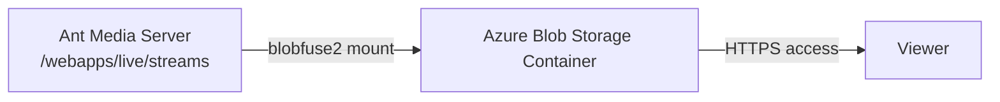

# Record Streams To Azure Blob Storage

Azure Blob Storage is a cloud-based storage service designed to store large amounts of unstructured data, such as images, videos, backups, or documents. It offers scalable, durable, and cost-effective storage for various types of files, which can be accessed globally over HTTP/HTTPS. It is commonly used for data archiving and streaming media.

In comparison to other S3 storages, Azure Blob Storage works with a FUSE mount using `blobfuse2`. In this case, it is **not** necessary to set any S3 settings in the AMS web panel — instead, the streams directory is mounted directly to the blob container.



## Step 1: Install Blobfuse2

Install `blobfuse2` on the same instance where your Ant Media Server is running. Check out the installation guide on the [Microsoft documentation](https://learn.microsoft.com/en-us/azure/storage/blobs/blobfuse2-how-to-deploy?tabs=Ubuntu#option-1-install-blobfuse2-from-the-microsoft-software-repositories-for-linux).

You can change the OS distribution and version in the command as per your requirement.

## Step 2: Create an Azure Blob Storage Account

1. In the Azure portal, search for **Storage accounts** and create a new one.
2. Select your **subscription** and **resource group**.
3. Define the **name** of your storage account and the **region**. It is preferable to use the same region where your Ant Media Server is hosted for better read/write speed.

## Step 3: Create a Container

1. After the storage account is created, go to **Containers** under Data Storage.
2. Create one container with default settings.

## Step 4: Copy the Access Key

1. Once the container has been created, go to **Access Keys** under Security & Networking.
2. Copy the access key — it will be required in the next steps.

## Step 5: Create the Blobfuse2 Configuration File

Create a YAML file for the FUSE connection to the Azure Blob Storage account. For example, create `fuse_connection.yaml` in the `blobfuse_config` folder of your home directory.

You need to replace the following placeholders with your actual values:

| Placeholder | Description |
|---|---|
| `storage-account-name` | Your Azure storage account name |
| `storage-account-access-key` | The access key copied in Step 4 |
| `https://storagename.blob.core.windows.net/` | Your storage account endpoint |
| `your-container-name` | The container name created in Step 3 |

```yaml
allow_other: true

logging:
  type: syslog
  level: log_debug

components:
  - libfuse
  - stream
  - attr_cache
  - azstorage

libfuse:
  attribute-expiration-sec: 120
  entry-expiration-sec: 120
  negative-entry-expiration-sec: 240

stream:
  block-size-mb: 1
  max-buffers: 4
  buffer-size-mb: 128

attr_cache:
  max-size-mb: 1024
  timeout-sec: 3600

azstorage:
  type: block
  account-name: amsblobtest
  account-key: your-access-key-copied-from-previous-step
  endpoint: https://amsblobtest.blob.core.windows.net/
  mode: key
  container: test-container
```

## Step 6: Mount Azure Blob Storage

The following command mounts the streams directory of any Ant Media Server application to Azure Blob Storage.

For example, to link the `live` application's streams directory to the storage account:

```bash
sudo blobfuse2 mount /usr/local/antmedia/webapps/live/streams \
  --config-file ~/blobfuse_config/fuse_connection.yaml \
  -o allow_other
```

After mounting, all recordings or files of the `live` application will be stored in the Azure Storage account container automatically.

:::info
Because Azure Blob Storage uses a filesystem mount rather than S3 API calls, you do not need to configure the S3 Recording settings in the AMS web panel. All file writes to the streams directory go directly to Azure.
:::
