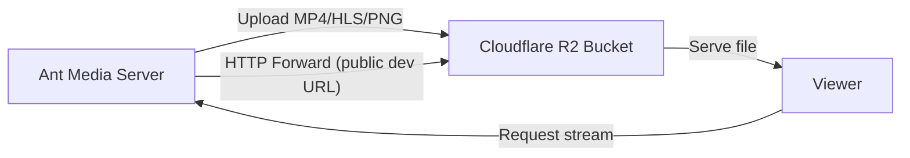

# Record Streams To Cloudflare R2 Object Storage

Cloudflare is another cloud provider that is preferred by many Ant Media Server users. You can integrate your AMS instance easily with Cloudflare R2 object storage in a few steps.



## Step 1: Create an R2 Storage Bucket

1. In the Cloudflare dashboard, go to **R2 Object Storage**.
2. Click **Create Bucket**.
3. Enter your bucket name and configure the remaining settings.

## Step 2: Create API Tokens for Access and Secret Keys

1. After creating the bucket, click **Manage API Token**.
2. Under **Manage API Token**, create an **Account API token**.
3. Configure the token with the appropriate permissions (read/write for R2).
4. After generating the token, copy the:
   - **Access Key**
   - **Secret Key**
   - **Endpoint** URL

## Step 3: Configure Ant Media Server

1. Log in to your AMS web panel.
2. Go to the application you use (e.g., `live`) and open **Settings**.
3. Enable **Record Live Streams as MP4**.
4. Enable **S3 Recording**.
5. Enter the S3 credentials you created:
   - **Access Key**: from R2 API token
   - **Secret Key**: from R2 API token
   - **Bucket Name**: your R2 bucket name
   - **Endpoint**: your R2 endpoint URL
6. Save the settings.

Your recording files will be uploaded to your **Cloudflare R2 Object Storage** automatically.

## Enable HTTP Forwarding for Playback

When your stream (mp4, m3u8 or preview) files are uploaded to R2 Object Storage, they are removed from Ant Media Server local storage. If you try to access them using the AMS URL, you may encounter a **404 Not Found** error.

To resolve this, enable **HTTP Forwarding** so Ant Media Server automatically redirects requests to your R2 Object Storage.

### Enable the Public Development URL

Before enabling HTTP forwarding, the R2 bucket is not public by default. You need to generate the **public development URL** from the bucket settings to make bucket objects publicly accessible.

After enabling the public development URL, copy it — it will be needed in the AMS settings.

### Steps to Enable HTTP Forwarding

1. Log in to the Ant Media Server Management Panel.
2. Navigate to your application (e.g., `LiveApp`) and go to **Application Settings → Advanced Settings**.
3. Set the following properties:

   ```properties
   httpForwardingExtension: mp4,m3u8
   httpForwardingBaseURL: https://pub-xxxx.r2.dev
   ```

   Example:

   ```json
   "httpForwardingExtension": "m3u8,mp4",
   "httpForwardingBaseURL": "https://pub-f6fd12cbd8f04a04a16547587df49ce4.r2.dev"
   ```

4. Save your settings.

## Playback

With forwarding enabled, your VOD files stored in Cloudflare R2 Object Storage can be played directly from AMS URLs, while the files are actually served from your R2 storage.

When you access:

```
https://your-domain:5443/AppName/streams/streamId.mp4
```

Ant Media Server will forward the request to:

```
https://pub-xxxx.r2.dev/streams/streamId.mp4
```
