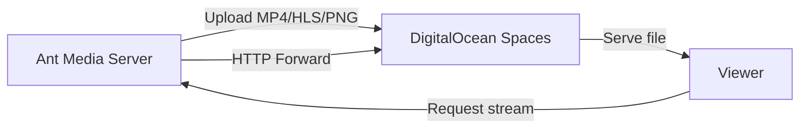

# Record Streams To DigitalOcean Spaces Object Storage

DigitalOcean is another cloud provider that is preferred by many Ant Media Server users. You could integrate your DigitalOcean cloud instance easily with Spaces object storage in a few steps.



## Step 1: Create a DigitalOcean Space

1. In the DigitalOcean dashboard, click the **Spaces** button.
2. Fill in the configuration (region, name, etc.).
3. Create the Space.

## Step 2: Create API Keys

1. Click the **API** button on the left side of the dashboard.
2. Click **Generate New Key**.
3. Enter a name and click **Create**.
4. Copy the **Access Key** and **Secret Key** that are generated.

## Step 3: Configure Ant Media Server

1. Log in to your Ant Media Server panel at `http://your_ams_server:5080`.
2. Navigate to **Applications** > **live** > **Settings**.
3. Enable **Record Live Streams as MP4** and **Enable S3 Recording**.
4. Enter the following S3 credentials:
   - **Access Key**: `your_access_key`
   - **Secret Key**: `your_secret_key`
   - **Bucket Name**: `your_space_name`
5. **Save** the settings.

Your MP4 and Preview files will be uploaded to your **DigitalOcean Spaces** automatically.

## Enable HTTP Forwarding for Playback

When your stream (mp4, m3u8 or preview) files are uploaded to DigitalOcean Spaces, they are removed from Ant Media Server local storage. If you try to access them using the AMS URL, you may encounter a **404 Not Found** error.

To resolve this, enable **HTTP Forwarding** so Ant Media Server automatically redirects requests to your DigitalOcean Space.

### Steps to Enable HTTP Forwarding

1. Log in to the Ant Media Server Management Panel.
2. Navigate to your application (e.g., `live`) and go to **Application Settings → Advanced Settings**.
3. Set the following properties:

   ```properties
   httpForwardingExtension: mp4,m3u8
   httpForwardingBaseURL: https://{s3BucketName}.{region}.digitaloceanspaces.com
   ```

   Example:

   ```properties
   httpForwardingExtension: mp4,m3u8
   httpForwardingBaseURL: https://mybucket.nyc3.digitaloceanspaces.com
   ```

4. Save your settings.

## Playback

With forwarding enabled, your VOD files stored in DigitalOcean Spaces can be played directly from AMS URLs, while the files are actually served from your DigitalOcean Space.

When you access:

```
https://your-domain:5443/live/streams/recording.mp4
```

Ant Media Server will forward the request to:

```
https://mybucket.nyc3.digitaloceanspaces.com/streams/recording.mp4
```
