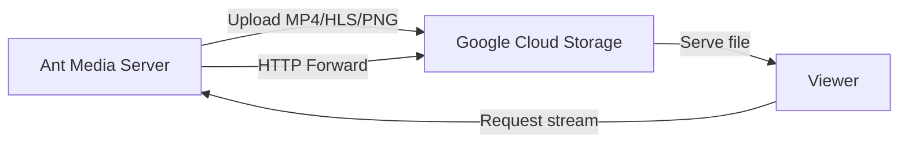

# Record Streams To Google Cloud Storage

Google Cloud is another cloud provider that is preferred by many Ant Media Server users. You could integrate your Google Cloud instance easily with Google Cloud Storage (GCS) using the S3-compatible interoperability API.



## Step 1: Create a Google Cloud Storage Bucket

1. In the Google Cloud Console, create a **Bucket**.
2. Click the **Create** button and fill in the configuration.
3. Choose the access level as **Fine-grained**.

## Step 2: Create a `streams` Folder

1. Go to the bucket you just created.
2. Create a folder named `streams` inside the bucket.

## Step 3: Generate HMAC Access Keys

Google Cloud Storage supports S3-compatible interoperability via HMAC keys.

1. Go to **Settings** on the left side of the Cloud Console.
2. Select the **Interoperability** tab.
3. Under **User Account HMAC**, choose the **default project for interoperability access**.
4. **Create an access key** for the user account.
5. Copy the **Access Key** and **Secret Key** — these are the credentials you will use in Ant Media Server.

## Step 4: Configure Ant Media Server

1. Log in to your Ant Media Server panel at `http://your_ams_server:5080`.
2. Navigate to **Applications** > **live** > **Settings**.
3. Enable **Record Live Streams as MP4** and **Enable S3 Recording**.
4. Enter the following S3 credentials:
   - **Access Key**: `your_access_key`
   - **Secret Key**: `your_secret_key`
   - **Bucket Name**: `your_bucket_name`
5. **Save** the settings.

Your MP4 and preview files will be uploaded to your **Google Cloud Storage Bucket** automatically.

## Enable HTTP Forwarding for Playback

After uploading to Google Cloud Storage, your files will no longer be available in the Ant Media Server local storage. If you try to access them using an AMS URL, you may encounter a **404 Not Found** error.

To resolve this, enable **HTTP Forwarding** so Ant Media Server automatically redirects requests to Google Cloud Storage.

### Steps to Enable HTTP Forwarding

1. Log in to the Ant Media Server Management Panel.
2. Navigate to your application (e.g., `live`) and go to **Application Settings → Advanced Settings**.
3. Set the following properties:

   ```properties
   httpForwardingExtension: mp4,m3u8
   httpForwardingBaseURL: https://storage.googleapis.com/{bucket-name}
   ```

   Example:

   ```properties
   httpForwardingExtension: mp4,m3u8
   httpForwardingBaseURL: https://storage.googleapis.com/mybucket
   ```

4. Save your settings.

## Playback

Once forwarding is configured, your VOD files stored in Google Cloud Storage can be played directly using AMS URLs. The media will be served from Google Cloud, while viewers continue to use your Ant Media Server domain.

When you access:

```
https://your-domain:5443/live/streams/recording.mp4
```

Ant Media Server will forward the request to:

```
https://storage.googleapis.com/mybucket/streams/recording.mp4
```
