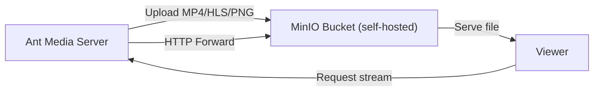

# Record Streams To MinIO Storage Bucket

MinIO is an open-source, high-performance object storage system that adheres to the Amazon S3 API standards. It enables organizations to deploy scalable, cost-effective storage solutions on-premises or in the cloud. Unlike proprietary options like AWS S3 and Google Cloud Storage, MinIO offers greater control over infrastructure and customization, making it ideal for edge computing, hybrid cloud setups, and data-intensive applications. It supports seamless integration with existing S3-compatible tools and applications.



## Prerequisites

Install MinIO on your Ubuntu Linux server. For installation, check the [MinIO installation guide](https://min.io/docs/minio/linux/operations/installation.html). This guide uses the [single node and single drive](https://min.io/docs/minio/linux/operations/install-deploy-manage/deploy-minio-single-node-single-drive.html) option.

Once installation is complete and you can access the MinIO console at `http://IP-or-domain:9001`, follow the steps below.

## Step 1: Set the MinIO Region

1. Go to **Configuration** in the MinIO console.
2. Set the region. MinIO uses AWS S3 API region names (e.g., `ap-south-1` for Asia Pacific).
3. After setting the region, restart the MinIO server when prompted.

## Step 2: Generate Access Keys

1. Go to **Access Keys** in the MinIO console.
2. Click **Create access key**.
3. Copy the **Access Key** and **Secret Key** — you will need these in Ant Media Server.

## Step 3: Create an S3 Bucket

1. Go to **Buckets** and create a new S3 bucket.
2. After the bucket is created, make sure it is **public** (or configure the appropriate access policy).

## Step 4: Configure Ant Media Server

1. Log in to your Ant Media Server web panel.
2. Go to any application's settings and enable **S3 Recording**.
3. Add the required details according to your bucket information:
   - **Access Key**: your MinIO access key
   - **Secret Key**: your MinIO secret key
   - **Bucket Name**: your MinIO bucket name
   - **Endpoint**: your MinIO server URL (e.g., `http://minio.example.com:9000`)
4. Save the settings.

Once a stream is published and stopped, the recording will be uploaded to the MinIO bucket under the `streams` folder.

## Enable HTTP Forwarding for Playback

After uploading to MinIO, your files will no longer be stored in the Ant Media Server local storage. If you try to access them via the AMS URL, you may encounter a **404 Not Found** error.

To resolve this, enable **HTTP Forwarding** so Ant Media Server automatically redirects requests to MinIO.

### Steps to Enable HTTP Forwarding

1. Log in to the Ant Media Server Management Panel.
2. Navigate to your application (e.g., `live`) and go to **Application Settings → Advanced Settings**.
3. Set the following properties:

   ```properties
   httpForwardingExtension: mp4,m3u8
   httpForwardingBaseURL: http://{your-minio-domain}:{port}/{bucket-name}
   ```

   Example:

   ```properties
   httpForwardingExtension: mp4,m3u8
   httpForwardingBaseURL: http://minio.example.com:9000/mybucket
   ```

4. Save the settings.

## Playback

With forwarding enabled, your recorded files stored in MinIO can be played using AMS URLs. Your viewers continue to access media via Ant Media Server, while the actual content is served from MinIO.

When you access:

```
https://your-domain:5443/live/streams/recording.mp4
```

Ant Media Server will forward the request to:

```
http://minio.example.com:9000/mybucket/streams/recording.mp4
```
