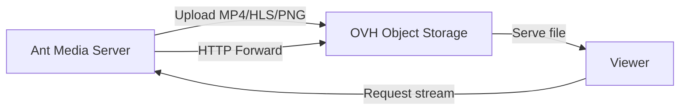

# Record Streams To OVH Object Storage

OVH is a cost-effective cloud provider that many people prefer. If you installed Ant Media Server on an OVH cloud instance, you may wish to upload your stream recordings to OVH Object Storage. You could accomplish that in a few steps.



## Step 1: Generate OVH API Credentials

Generate a **Secret Key** and **Access Key** with your OpenStack username and password. You can learn more about it in OVH's documentation.

## Step 2: Create an OVH Object Storage Container

After generating the Secret Key and Access Key, create an Object Storage container from the OVH console. Note your container name and region.

## Step 3: Configure Ant Media Server

1. Log in to your Ant Media Server panel at `http://your_ams_server:5080`.
2. Navigate to **Applications** > **live** > **Settings**.
3. Enable **Record Live Streams as MP4**.
4. Enable **S3 Recording**.
5. Enter the following S3 credentials:
   - **Access Key**: `your_access_key`
   - **Secret Key**: `your_secret_key`
   - **Bucket Name**: `your_bucket_name`
6. **Save** the settings.

Your MP4 and Preview files will be uploaded to your **OVH Object Storage** automatically.

## Enable HTTP Forwarding for Playback

When your stream (mp4, m3u8 or preview) files are uploaded to OVH Object Storage, they are no longer available on the Ant Media Server local storage. If you try to play them directly from AMS using the usual URL, you may encounter a **404 Not Found** error.

To resolve this, enable **HTTP Forwarding** so Ant Media Server automatically redirects requests to your OVH Object Storage.

### Steps to Enable HTTP Forwarding

1. Log in to the Ant Media Server Management Panel.
2. Navigate to your application (e.g., `live`) and go to **Application Settings → Advanced Settings**.
3. Set the following properties:

   ```properties
   httpForwardingExtension: mp4,m3u8
   httpForwardingBaseURL: https://{s3BucketName}.{region}.cloud.ovh.net
   ```

   Example:

   ```properties
   httpForwardingExtension: mp4,m3u8
   httpForwardingBaseURL: https://mybucket.gra.cloud.ovh.net
   ```

4. Save your settings.

## Playback

Once forwarding is set up, you can embed or share the playback URLs directly from AMS, and behind the scenes the requests will be served from your OVH Object Storage.

When you access:

```
https://your-domain:5443/live/streams/recording.mp4
```

Ant Media Server will forward the request to:

```
https://mybucket.gra.cloud.ovh.net/streams/recording.mp4
```
