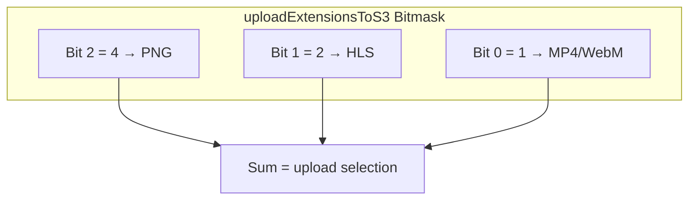
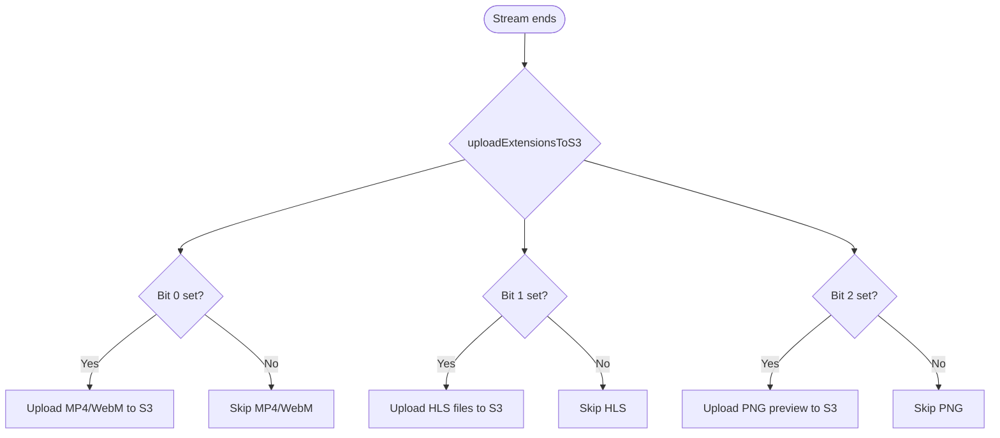

# S3 Upload Record Type

By default, Ant Media Server records and uploads **all file types** (HLS, MP4/WebM, PNG) to the configured S3 bucket.

For example, if you want to stream using HLS but only record in MP4 format without uploading HLS files to the bucket, you can control this with the following application property:

```json
"uploadExtensionsToS3": 7
```

You can modify this property in the application's **Advanced Settings** in the web panel.

## How the Bitmask Works

The value is a bitmask where each bit controls a specific file type:

| Bit Position | File Type | Bit Value |
|---|---|---|
| Bit 0 (least significant) | MP4 / WebM | 1 |
| Bit 1 | HLS (m3u8 + ts segments) | 2 |
| Bit 2 | PNG (preview/thumbnail) | 4 |

The final value is the sum of the bits for the types you want to upload.



## Possible Values

| Value | Binary | MP4/WebM | HLS | PNG | Description |
|---|---|---|---|---|---|
| `0` | `000` | No | No | No | No upload |
| `1` | `001` | Yes | No | No | MP4/WebM only |
| `2` | `010` | No | Yes | No | HLS only |
| `3` | `011` | Yes | Yes | No | HLS and MP4/WebM |
| `4` | `100` | No | No | Yes | PNG only |
| `5` | `101` | Yes | No | Yes | MP4/WebM and PNG |
| `6` | `110` | No | Yes | Yes | PNG and HLS |
| `7` | `111` | Yes | Yes | Yes | Upload everything (default) |

**Example:** `uploadExtensionsToS3=5` (binary `101`) means upload MP4/WebM and PNG but not HLS.

## Configuration

In your application's **Advanced Settings**, set:

```json
"uploadExtensionsToS3": 1
```

This uploads only MP4/WebM files and skips HLS and PNG uploads.

:::info
HLS recording can also be configured separately. Check out the [HLS recording documentation](https://antmedia.io/docs/guides/playing-live-stream/hls-playing/#save-hls-records) for details.
:::

## Decision Flow


