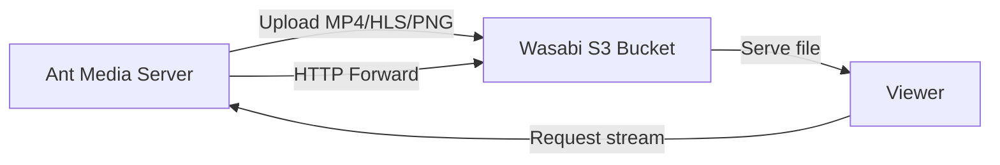

# Record Streams To Wasabi Storage

Wasabi is another cloud provider that is preferred by many Ant Media Server users. You could integrate your Wasabi storage with Ant Media Server in a few steps.



## Step 1: Create Access Keys in Wasabi

Log in to your Wasabi account and create a new access key. Wasabi provides S3-compatible Access Key ID and Secret Access Key pairs.

## Step 2: Create a Wasabi Bucket

Click the **Create Bucket** button in the Wasabi console and configure your bucket with a name and region.

## Step 3: Configure Ant Media Server

1. Log in to your Ant Media Server panel at `http://your_ams_server:5080`.
2. Navigate to **Applications** > **live** > **Settings**.
3. Enable **Record Live Streams as MP4** and **Enable S3 Recording**.
4. Enter the following S3 credentials:
   - **Access Key**: `your_access_key`
   - **Secret Key**: `your_secret_key`
   - **Bucket Name**: `your_space_name`
5. **Save** the settings.

Your MP4 and Preview files will be uploaded to your **Wasabi storage** automatically.

## Enable HTTP Forwarding for Playback

When your stream (mp4, m3u8 or preview) files are uploaded to Wasabi Storage, they are no longer available on Ant Media Server local storage. If you try to play them directly from AMS URLs, you may encounter a **404 Not Found** error.

To resolve this, enable **HTTP Forwarding** so Ant Media Server automatically redirects requests to Wasabi.

### Steps to Enable HTTP Forwarding

1. Log in to the Ant Media Server Management Panel.
2. Navigate to your application (e.g., `live`) and go to **Application Settings → Advanced Settings**.
3. Set the following properties:

   ```properties
   httpForwardingExtension: mp4,m3u8
   httpForwardingBaseURL: https://{bucket-name}.s3.{region}.wasabisys.com
   ```

   Example:

   ```properties
   httpForwardingExtension: mp4,m3u8
   httpForwardingBaseURL: https://mybucket.s3.us-east-1.wasabisys.com
   ```

4. Save your settings.

## Playback

Once forwarding is configured, you can share or embed your AMS URLs as usual. The media will actually be served from Wasabi, while users continue to use your Ant Media Server domain.

When you access:

```
https://your-domain:5443/live/streams/recording.mp4
```

Ant Media Server will forward the request to:

```
https://mybucket.s3.us-east-1.wasabisys.com/streams/recording.mp4
```
