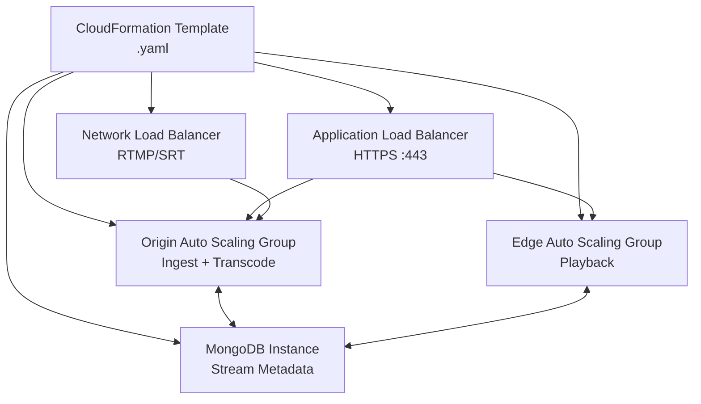

# Scale AMS with AWS CloudFormation

Deploy a complete Ant Media Server cluster — Origin group, Edge group, Auto Scaling, Load Balancers, and MongoDB — with a single CloudFormation template.



## Step 1: Subscribe on AWS Marketplace

Open [https://aws.amazon.com/marketplace/pp/B07569Y9SJ/](https://aws.amazon.com/marketplace/pp/B07569Y9SJ/) and click **View Purchase Options**, then **Subscribe**.

## Step 2: Download the CloudFormation Template

```
https://raw.githubusercontent.com/ant-media/Scripts/master/cloudformation/antmedia-aws-autoscale-template.yaml
```

## Step 3: Create the Stack

1. In the AWS Console, search for **CloudFormation** and click **Create Stack → With New Resources**.
2. Select **Choose an Existing Template → Upload a Template File** and upload the YAML file.

## Step 4: Specify Stack Details

| Parameter | Description |
|---|---|
| `AntMediaOriginCapacity` | Initial number of Origin servers |
| `AntMediaOriginCapacityMax` | Maximum Origin servers for Auto Scaling |
| `AntMediaEdgeCapacity` | Initial number of Edge servers |
| `AntMediaEdgeCapacityMax` | Maximum Edge servers for Auto Scaling |
| `CPUPolicyTargetValue` | CPU % threshold to trigger scale-out (default 60) |
| `OriginInstanceType` | EC2 instance type for Origin nodes |
| `EdgeInstanceType` | EC2 instance type for Edge nodes |
| `MongoDBInstanceType` | EC2 instance type for MongoDB |
| `GPUImage` | Set `true` to use GPU image for Origin (g/p instance types) |
| `KeyName` | EC2 key pair for SSH access |
| `LoadBalancerCertificateArn` | ARN of your ACM certificate |
| `Subnets` | At least 2 subnets from the same VPC |
| `VpcId` | Your VPC ID |
| `VpcCidrBlock` | CIDR block matching your VPC |
| `Email` | SNS notification email |
| `SSHLocation` | IP range allowed for SSH |
| `DiskSize` | EBS volume size for all instances |

## Step 5: Configure and Create

On the **Configure Stack Options** page, check **"I acknowledge that AWS CloudFormation might create IAM resources"** (required for Lambda to fetch the latest AMI). Click **Next**, review, and click **Create Stack**.

## Step 6: Access Your Cluster

When the stack shows **CREATE_COMPLETE**, open the **Outputs** tab to find:

- **Dashboard URL** — AMS management panel
- **Origin URL** — Ingest endpoint
- **Edge URL** — Playback endpoint  
- **RTMP URL** — RTMP ingest via Network Load Balancer

## Step 7: Configure DNS and SSL

The Load Balancer DNS names use AWS-issued certificates that do not match custom domains. To remove browser warnings:

1. Create **CNAME records** in your DNS pointing to both Load Balancer DNS names.
2. Request or import a certificate in **AWS Certificate Manager** for your domain.
3. Attach the certificate to the **Application Load Balancer** HTTPS listener.
4. For the **Network Load Balancer** (RTMP/SRT), a CNAME alone is sufficient — no certificate required.

## Delete Stack

To tear down all resources, select the stack in CloudFormation and choose **Delete Stack**. AWS will remove all EC2 instances, load balancers, MongoDB, and security groups automatically.

:::info
Questions or issues? Post in [GitHub Discussions](https://github.com/orgs/ant-media/discussions).
:::
