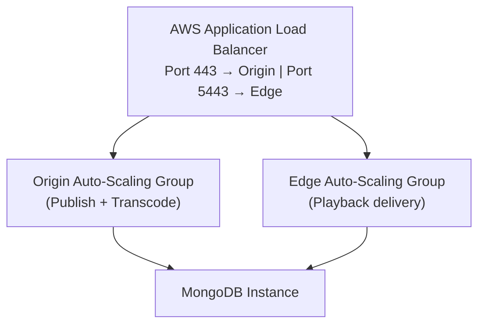

# Clustering with AWS

This document explains how to set up a scalable Ant Media Server cluster in Amazon Web Services. Scaling is required when a single server cannot meet the required demand.



**Key components:**
- **MongoDB Server**: Stores stream information so edge nodes can locate the origin of any stream.
- **Load Balancer**: Entry point for publishers (port 443) and players (port 5443).
- **Origin Auto-Scaling Group**: Ingests WebRTC streams, registers origin in MongoDB. Auto-scales based on CPU.
- **Edge Auto-Scaling Group**: Receives play requests, looks up origin from MongoDB, fetches and delivers stream.

## Step 1: Install MongoDB Server

Launch an EC2 instance (Ubuntu 20.04, recommended: m4.xlarge or m5.xlarge):

1. In EC2, click **Launch Instance**.
2. Select **Ubuntu 20.04**.
3. Choose instance type (avoid ARM-based m5a series).
4. Configure Security Group — open TCP ports **22** and **27017** (restrict 27017 to your VPC later).
5. Create and download a key pair.

Once the instance is running:

```bash
wget https://raw.githubusercontent.com/ant-media/Scripts/master/install_mongodb.sh \
  && chmod +x install_mongodb.sh
./install_mongodb.sh
```

Note the MongoDB instance's local (private) IP address.

## Step 2: Create Origin Launch Template

1. Go to **EC2 → Launch Templates → Create Launch Template**.
2. Give it a name: `Origin-Group`.
3. Under **Application and OS Images**, browse AWS Marketplace AMIs and search for **Ant Media Server Enterprise**.
4. Select instance type (e.g., c5.xlarge).
5. Configure Security Group — open:
   - UDP 50000-60000 (WebRTC)
   - TCP 5000 (cluster internal communication)
6. Under **Advanced Details → User data**, add the startup script:

```bash
#!/bin/bash
cd /usr/local/antmedia
./change_server_mode.sh cluster {MongoIP}
```

Replace `{MongoIP}` with your MongoDB instance's private IP.

7. Click **Create Launch Template**.

## Step 3: Create Origin Auto Scaling Group

1. Go to **EC2 → Auto Scaling Groups → Create Auto Scaling Group**.
2. Name it `AMS-Origin-Group`.
3. Select the launch template created above.
4. Choose a single subnet for better internal connectivity.
5. Attach to the load balancer (created in Step 4).
6. Set scaling policy: CPU Utilization at 60%, maximum 10 instances.

## Step 4: Create Edge Launch Template and Auto Scaling Group

Repeat Steps 2 and 3 for the edge group with these differences:
- Name it `Edge-Group` (and `AMS-Edge-Group`).
- Configure scaling policy and instance type according to expected viewer load.

## Step 5: Create Application Load Balancer

1. Go to **EC2 → Load Balancers → Create → Application Load Balancer**.
2. Configure subnets across at least two availability zones.
3. Create target groups for Origin (HTTP, port 5080) and Edge (HTTP, port 5080).
4. Set the Load Balancing algorithm to **Least Outstanding Requests** for both groups.
5. Add listeners:
   - **HTTP (80)** and **HTTPS (443)** → forward to Origin target group
   - **HTTP (5080)** and **HTTPS (5443)** → forward to Edge target group
6. Upload your domain certificate in **Secure listener settings**.
7. Add a CNAME in your DNS pointing to the load balancer DNS name.

### URL Routing Rules

Add routing rules so you can reach origin or edge via a single domain:

- `https://yourdomain.com/WebRTCAppEE/index.html?target=origin` → Origin cluster
- `https://yourdomain.com/WebRTCAppEE/index.html?target=edge` → Edge cluster

## Testing

**Publish**: Visit `https://your-domain-name/WebRTCAppEE/` and click **Start Publishing**.

**Play**: Visit `https://your-domain-name:5443/WebRTCAppEE/player.html` and click **Start Playing**.

## Reset Dashboard Password

If you need to reset the admin password, SSH into your MongoDB instance and run:

```bash
# Encrypt your new password with MD5
echo -n 'new-password' | md5sum

# Connect to MongoDB
mongo
use serverdb
db.User.updateOne({"_id": "[Replace with user ID]"}, {$set:{password: "[encrypted-md5-password]"}})
```
