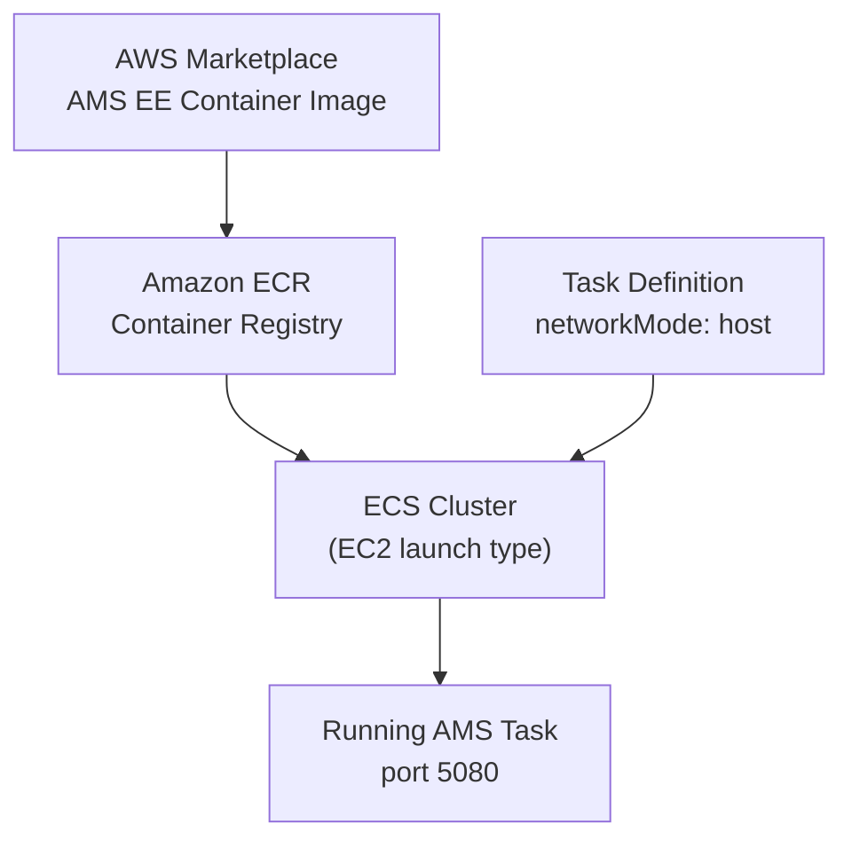

# Deploy AMS on AWS ECS

This guide explains how to run the Ant Media Server Enterprise Edition container on Amazon Elastic Container Service (ECS) in cluster mode using the EC2 launch type.



## Step 0: Subscribe to the AMS Container on AWS Marketplace

Go to the [Ant Media Server Enterprise container listing](https://aws.amazon.com/marketplace/pp/prodview-w5vfsfcf3puju) and subscribe.

## Step 1: Create an ECS Cluster

1. Navigate to **Amazon Elastic Container Service → Clusters → Create Cluster**.
2. Configure:
   - **Cluster name**: `test-cluster`
   - **Infrastructure**: Amazon EC2 instance
   - **Provisioning model**: On-demand
   - **EC2 instance type**: `c5.xlarge` (adjust as needed)
   - **Desired capacity**: as needed
   - **SSH Key pair**: select or create a key pair
3. Under **Network Settings**, choose a public VPC and set **Auto-assign public IP** to `True`.
4. Click **Create**.

## Step 2: Create an IAM Task Execution Role

1. Go to **IAM → Roles → Create Role**.
2. **Trusted entity type**: AWS service
3. **Use case**: Elastic Container Service Task
4. Attach these policies:
   - `AmazonECSTaskExecutionRolePolicy`
   - `AWSMarketplaceMeteringRegisterUsage`
5. Name the role `ecsTaskExecutionRole-test-cluster` and create it.

## Step 3: Create a Task Definition

Go to **Task Definitions → Create New Task Definition with JSON** and paste the following, replacing `xxxxxxxx` with your actual IAM role ARN:

```json
{
  "family": "ams-task-definiton",
  "containerDefinitions": [
    {
      "name": "ams",
      "image": "709825985650.dkr.ecr.us-east-1.amazonaws.com/ant-media/ant-media-server-ee:2.11.3",
      "cpu": 0,
      "portMappings": [],
      "essential": true,
      "environment": [],
      "mountPoints": [],
      "volumesFrom": []
    }
  ],
  "taskRoleArn": "arn:aws:iam::xxxxxxxx:role/ecsTaskExecutionRole",
  "executionRoleArn": "arn:aws:iam::xxxxxxxx:role/ecsTaskExecutionRole",
  "networkMode": "host",
  "requiresCompatibilities": ["EC2"],
  "cpu": "4048",
  "memory": "4096",
  "runtimePlatform": {
    "cpuArchitecture": "X86_64",
    "operatingSystemFamily": "LINUX"
  }
}
```

Update the `image` tag to use the latest AMS version if needed. Adjust `cpu` and `memory` for your workload.

## Step 4: Run the Task

1. Go to **ECS Clusters → test-cluster → Tasks → Run New Task**.
2. Under **Compute configuration**, choose **EC2** as the launch type.
3. Under **Deployment configuration → Task Definition**, select `ams-task-definition`.
4. Click **Create**.

Verify the task shows **RUNNING** status in the Tasks tab.

## Step 5: Access AMS

1. Open the **EC2 Dashboard → Instances** and find the instance running your container.
2. Note its public IP address.
3. Open `http://<EC2-Instance-IP>:5080` in your browser and create your admin credentials.

AMS is now running on AWS ECS and ready for streaming.
