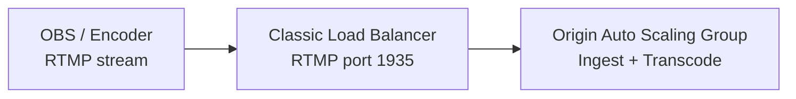

# Configure RTMP Load Balancer on AWS

In an AMS Auto Scaling cluster, RTMP streams are ingested by Origin nodes. This guide creates a Classic Load Balancer for RTMP traffic and attaches it to the Origin Auto Scaling Group.



## Steps

1. In the EC2 console, go to **Load Balancers → Create Load Balancer**.
2. Select **Classic Load Balancer**.
3. Configure the load balancer:
   - **Load Balancer Port**: 1935 (RTMP)
   - **Instance Port**: 1935
   - **Protocol**: TCP
4. Create a **new Security Group** allowing inbound TCP on port 1935.
5. Configure the **Health Check**:
   - **Ping Protocol**: TCP
   - **Ping Port**: 1935
6. Skip adding EC2 instances manually — they will be added via Auto Scaling.
7. Review and click **Create**.

## Attach to Origin Auto Scaling Group

1. Go to **Auto Scaling → Auto Scaling Groups** and select your Origin group.
2. Edit the **Load Balancing** settings.
3. In the **Classic Load Balancers** section, select the load balancer you just created.
4. Click **Update**.

After the Origin instances register with the load balancer, they will appear in the **Instances** tab of your Classic Load Balancer.

## RTMP Ingest URL

Your RTMP publish URL becomes the Load Balancer's DNS name:

```
rtmp://Antmedia-RTMP-LB-962025612.eu-west-2.elb.amazonaws.com/WebRTCAppEE/
```

Replace the hostname with your actual Load Balancer DNS from the EC2 Load Balancers console.
