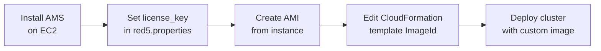

# Scale AMS with CloudFormation Using a Self-Hosted License

By default, the CloudFormation template uses the AWS Marketplace image of AMS. This guide covers how to bake your self-hosted license key into a custom AMI and use it with the CloudFormation template.



:::info
You must already have a self-hosted license. Contact contact@antmedia.io if needed.
:::

## Step 1: Create a Custom AMS AMI

### Install AMS

Launch a `c5.xlarge` EC2 instance and install AMS following the [standard installation guide](https://antmedia.io/docs/guides/installing-on-linux/installing-ams-on-linux/). SSL is not required for the AMI — ensure all required [server ports](https://resources.antmedia.io/docs/installation#server-ports) are open in the security group.

### Add Your License Key

SSH into the instance and edit `conf/red5.properties`:

```bash
echo "server.licence_key=YOUR_LICENSE_KEY" >> /usr/local/antmedia/conf/red5.properties
sudo service antmedia restart
```

Verify AMS starts correctly at `http://IP-address:5080`.

### Remove the Instance ID

```bash
rm /usr/local/antmedia/conf/instanceId
```

This ensures each new instance launched from the AMI gets its own unique ID.

### Create the AMI

In the EC2 console: **Instances → Actions → Image and templates → Create image**. Provide a name and description. Note the **AMI ID** after creation.

## Step 2: Edit the CloudFormation Template

Download the template:

```
https://raw.githubusercontent.com/ant-media/Scripts/master/cloudformation/antmedia-aws-autoscale-template.yaml
```

Replace `Put-Your-ImageId` with your AMI ID in the `LaunchTemplateOrigin` section:

```yaml
LaunchTemplateOrigin:
  ...
  LaunchTemplateData:
    ImageId: !If [UseGPUImage, !Ref AntMediaGPUAmi, ami-0123456789abcdef0]
```

And in the `LaunchTemplateEdge` section:

```yaml
LaunchTemplateEdge:
  ...
  LaunchTemplateData:
    ImageId: ami-0123456789abcdef0
```

:::info
For GPU Origin nodes, create a separate GPU-instance AMI and reference it in `!Ref AntMediaGPUAmi` instead.
:::

## Step 3: Deploy with CloudFormation

Follow the [CloudFormation deployment guide](./aws-cloudformation.md) from Step 3 onward. All remaining steps are identical. Your cluster will launch using your licensed AMI instead of the Marketplace image.
