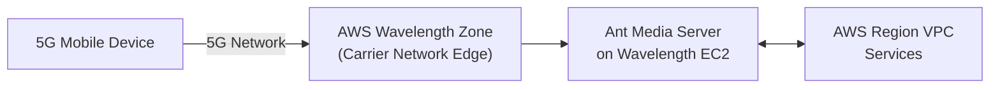

# Deploy AMS at AWS Wavelength

AWS Wavelength deploys AWS compute and storage at the edge of 5G carrier networks, enabling ultra-low latency connections to mobile devices. Deploying AMS on Wavelength can achieve sub-150ms latency under Wavelength conditions.

## Key Considerations

- **No Elastic Load Balancer in Wavelength Zones**: The CloudFormation template for Wavelength includes a special Nginx load balancer that listens to the Auto Scaling group and updates its configuration automatically — replacing the standard ALB that is unavailable in Wavelength zones.
- **SSL Configuration**: Wavelength instances require special SSL setup because they are at the carrier edge.
- **STUN Server Configuration**: WebRTC ICE candidates must be configured for the Wavelength topology.
- Requires **AMS v2.4.1 or later**.

## Deployment Options

Two CloudFormation-based deployment patterns are available for Wavelength:

### Standalone Server Deployment

Deploy a single AMS instance in a Wavelength Zone for development or low-traffic scenarios. See the [Standalone Wavelength deployment guide](https://antmedia.io/docs/guides/clustering-and-scaling/aws/aws-wavelength-standalone-deployment/).

### Auto-Scalable Cluster Deployment

Deploy an Origin + Edge cluster with Auto Scaling in Wavelength Zones. The custom Nginx load balancer automatically tracks Auto Scaling group membership. See the [Cluster Wavelength deployment guide](https://antmedia.io/docs/guides/clustering-and-scaling/aws/aws-wavelength-cluster-deployment/).

## Related Guides

- [SSL Setup](https://antmedia.io/docs/guides/installing-on-linux/setting-up-ssl/)
- [Configure STUN/TURN Addresses](https://antmedia.io/docs/guides/configuration-and-testing/configuring-stun-turn-addresses/)
