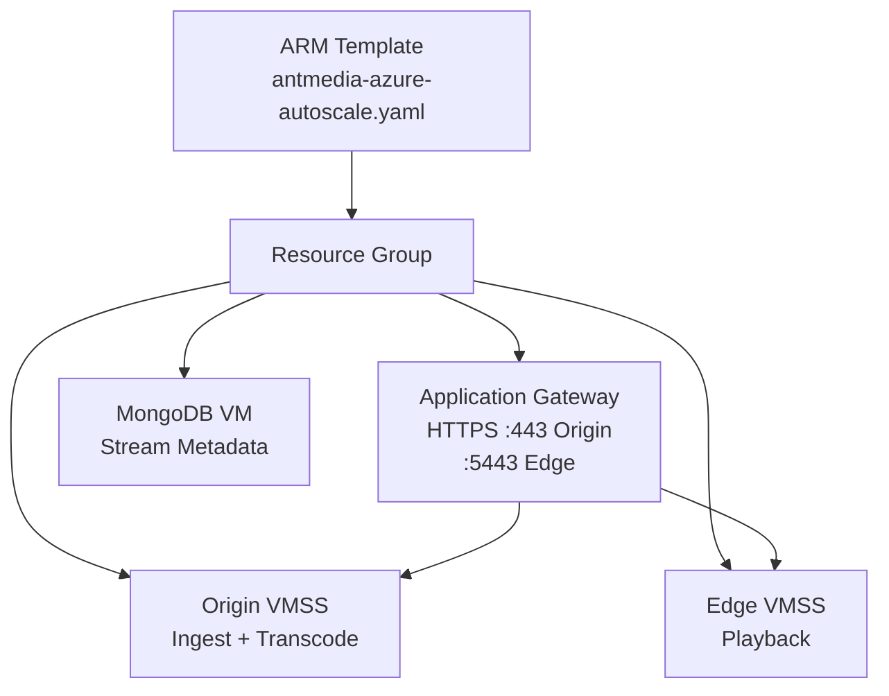

# Scale AMS with Azure ARM Template

Azure Resource Manager (ARM) allows you to automate the deployment of a full AMS cluster — VMSS, MongoDB, and Application Gateway — using a single declarative template.



## Step 1: Create a Resource Group

1. Sign in to [portal.azure.com](https://portal.azure.com).
2. Search for **Resource groups** and click **New**.
3. Specify a name and region.

## Step 2: Deploy the ARM Template

1. Search for **Deploy a custom template** in the Azure Portal.
2. Click **Build your own template in the editor**.
3. Download the template from:

```
https://raw.githubusercontent.com/ant-media/Scripts/master/azure-arm-template/antmedia-azure-autoscale.yaml
```

4. Upload the template using **Load file**, then click **Save**.

## Step 3: Fill in Parameters

| Parameter | Description |
|---|---|
| Resource Group | The resource group created in Step 1 |
| Region | Deployment region |
| Origin Instance Capacity | Number of Origin VMSS instances |
| Origin Instance Type | VM size for Origin nodes |
| Edge Instance Capacity | Number of Edge VMSS instances |
| Edge Instance Type | VM size for Edge nodes |
| CPU Policy Target Value | CPU % threshold for auto scale (default 60) |
| MongoDB Instance Type | VM size for MongoDB |
| Cert Data | Base64-encoded certificate in PFX format |
| Cert Password | Password for the PFX certificate |
| Authentication Type | `password` or SSH key for instance access |

## Certificate Preparation

If you do not have a certificate, generate one with Let's Encrypt. Then convert to PFX and base64:

```bash
# Convert certificate to PFX format
openssl pkcs12 -inkey /etc/letsencrypt/live/yourdomain.com/privkey.pem \
  -in /etc/letsencrypt/live/yourdomain.com/cert.pem \
  -export -out yourdomain.com.pfx

# Encode PFX as base64
openssl base64 -in yourdomain.com.pfx -out yourdomain.com.base64
```

Paste the contents of `yourdomain.com.base64` into the **Cert Data** field.

## Step 4: Deploy

Click **Review + Create** and then **Create**. The deployment typically completes in a few minutes.

## Step 5: Access Your Cluster

1. Navigate to the **Application Gateway** service.
2. Use the **Public IP** of the Application Gateway to access the AMS dashboard.
3. Alternatively, create a DNS A record pointing your domain to the Application Gateway IP.

The Application Gateway routes:
- Port **443** → Origin nodes (ingest)
- Port **5443** → Edge nodes (playback)
- Port **4444** → AMS management dashboard
