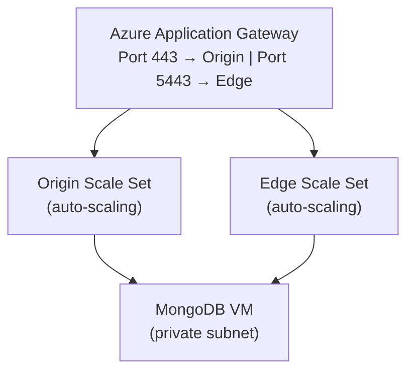

# How to Setup Ant Media Server Cluster on Azure

This guide explains how to set up Ant Media Server clustering on Azure. When a single server cannot handle high traffic, a cluster allows you to manage the load efficiently.

For streaming applications with many publishers and viewers, a clustering solution becomes essential — especially when ultra-low latency and adaptive bitrate are required. Ant Media Server Enterprise Edition supports clustering to distribute load across multiple servers.

## Architecture



## Step 1: Create a Resource Group

Create a resource group named `antmedia-cluster` to contain all cluster resources.

## Step 2: Create a Virtual Network

Create a virtual network named `antmedia-cluster-virtual-network` with the following subnets:
- `antmedia-origin-subnet`
- `antmedia-edge-subnet`
- `antmedia-gw-subnet`

## Step 3: Create a MongoDB Virtual Machine

Launch an Ubuntu 18.04 LTS VM in the `antmedia-cluster` resource group:

1. In **Networking**, select the virtual network created above.
2. Configure a network security group allowing inbound port **27017** (restrict to VPC).
3. In **Advanced → Custom data**, add the startup script:

```bash
#!/bin/bash
wget https://raw.githubusercontent.com/antmedia/Scripts/master/install_mongodb.sh \
  && chmod +x install_mongodb.sh
./install_mongodb.sh
```

Note the MongoDB VM's private IP address.

## Step 4: Create Application Gateway

Create an Azure Application Gateway to route traffic:

1. Search for **Application Gateway** in the portal and click **Create**.
2. Set resource group, name, region, and select the virtual network with `antmedia-gw-subnet`.
3. Add a public IP address.
4. Create backend pools for **Origin** and **Edge**.
5. Add routing rules:
   - Port **80/443** → Origin backend pool
   - Port **5080/5443** → Edge backend pool
6. Configure SSL certificate (see the [Azure SSL guide](https://antmedia.io/ssl-for-azure-app-gateway-for-scaling-azure-ant-media/)).

## Step 5: Create Origin and Edge Scale Sets

### Origin Scale Set

1. Go to **Compute → Virtual Machine Scale Sets → Create**.
2. Select the `antmedia-cluster` resource group.
3. Under **OS Image**, search for **Ant Media Server Enterprise** in the marketplace.
4. In **Networking**, select `antmedia-cluster-virtual-network` → `origin-subnet`.
5. Set load balancer to the Application Gateway created above, backend pool: **Origin**.
6. Set scaling: CPU Utilization at 60%.
7. In **Advanced → Custom data**, add the startup script:

```bash
#!/bin/bash
cd /usr/local/antmedia/
./change_server_mode.sh cluster {MONGODB_PRIVATE_IP}
```

Replace `{MONGODB_PRIVATE_IP}` with your MongoDB VM's private IP.

### Edge Scale Set

Repeat the Origin Scale Set steps with these differences:
- Use `antmedia-edge-subnet` as the network interface.
- Select **Edge** as the Application Gateway backend pool.

## Step 6: Test the Cluster

Verify the cluster is working:

- **Edge**: `https://application-gateway-ip:5443`
- **Origin**: `https://application-gateway-ip`

In the AMS dashboard, go to the **Cluster** menu to see all joined nodes.

## Streaming Test

**Publish**: Visit `https://your-domain-name/live/` and click **Start Publishing**.

**Play**: Visit `https://your-domain-name:5443/live/player.html`, enter your stream ID, and click **Start Playing**.
