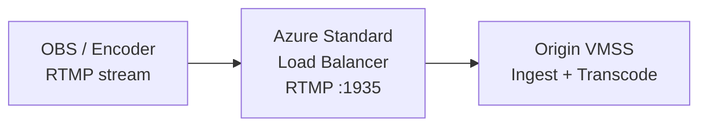

# Configure RTMP Load Balancer on Azure

Follow these steps to add a Standard Load Balancer for RTMP ingest in your Ant Media Server Auto Scaling cluster on Azure.



## Steps

1. In the Azure Portal, search for **Load Balancing** and click **Create Load Balancer**.

2. On the **Basics** tab:
   - Select your **Resource Group**.
   - Set **Type** to **Public**.
   - Set **SKU** to **Standard**.
   - Click **Next: Frontend IP configuration**.

3. Under **Frontend IP configuration**, click **Add a frontend IP configuration**:
   - Create a new public IP address for the RTMP load balancer.

4. Under **Backend pools**, click **Add a backend pool**:
   - Select your **Virtual Network**.
   - Set the **Backend Pool** to your **Origin Scale Set (VMSS)**.

5. Under **Load balancing rules**, click **Add a load balancing rule**:
   - **Protocol**: TCP
   - **Frontend port**: 1935
   - **Backend port**: 1935
   - Create a **Health Probe** on port 1935 (TCP).

6. Click **Review + create** and then **Create**.

## Find Your RTMP Endpoint

After the Load Balancer is created:

1. Go to **Load Balancing → your Load Balancer → Frontend IP configuration**.
2. Note the public IP address.

Your RTMP publish URL:

```
rtmp://<FRONTEND_IP>/WebRTCAppEE/
```

Replace `WebRTCAppEE` with your actual AMS application name.
