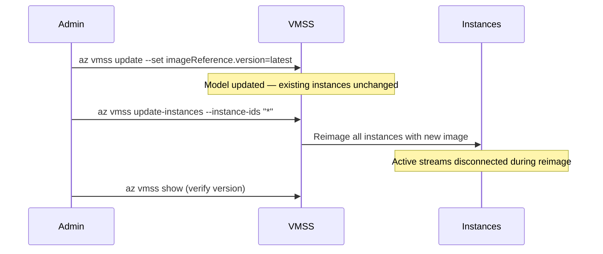

# Upgrade AMS on Azure VMSS

This guide covers updating the AMS image version on an existing Azure Virtual Machine Scale Set (VMSS) cluster using the Azure CLI.



:::warning
The `update-instances` command restarts machines and wipes the OS disk to install the new image. Any active live streams will be disconnected during this process. Plan the upgrade during low-traffic periods.
:::

## Step 1: Update the VMSS Model

This updates the Scale Set blueprint to use the new image. Running instances are not affected until Step 2.

```bash
az vmss update \
  --resource-group <Your-Resource-Group> \
  --name <Your-VMSS-Name> \
  --set \
    virtualMachineProfile.storageProfile.imageReference.publisher="antmedia" \
    virtualMachineProfile.storageProfile.imageReference.offer="ant_media_server_enterprise" \
    virtualMachineProfile.storageProfile.imageReference.sku="enterprise_edition" \
    virtualMachineProfile.storageProfile.imageReference.version="latest"
```

To pin to a specific version instead of `latest`:

```bash
    virtualMachineProfile.storageProfile.imageReference.version="2.16.2"
```

## Step 2: Apply the New Image to Instances

Trigger all existing instances to adopt the new model:

```bash
az vmss update-instances \
  --resource-group <Your-Resource-Group> \
  --name <Your-VMSS-Name> \
  --instance-ids "*"
```

## Step 3: Verify the Upgrade

**Via Azure Portal**: Navigate to **VMSS → Settings → Operating System → Image Reference** and check the version.

**Via CLI**:

```bash
az vmss show \
  -g <Your-Resource-Group> \
  -n <Your-VMSS-Name> \
  --query "virtualMachineProfile.storageProfile.imageReference.version"
```

**Via AMS Dashboard**: Log in to the web panel and check the version number displayed in the bottom right corner.
