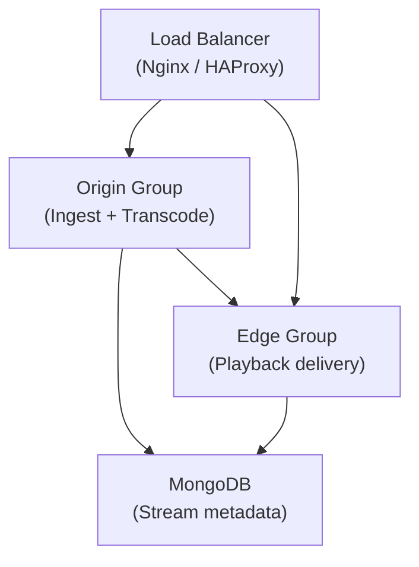

# Cluster Installation

Ant Media Server (AMS) can be deployed in a cluster configuration to enhance scalability and reliability. This setup allows multiple AMS nodes to work together, thereby increasing the number of viewers and publishers that can be supported. You can publish a live stream to one AMS node within the cluster, and that stream can be viewed from another node within the same cluster.

## Components of an AMS Cluster



### 1. Database (MongoDB)

The database stores all stream-related information — bitrates, settings, the origin node of the stream, and additional metadata. All nodes in the cluster access this information to facilitate seamless streaming.

### 2. Origin Group

Origin group nodes ingest live streams and perform transcoding and transmuxing. Streams are then distributed to edge nodes. Viewers do not connect directly to origin nodes. GPU-equipped nodes are recommended here if ABR streaming is enabled.

### 3. Edge Group

Edge nodes receive streams from origin nodes and deliver them to viewers. They do not ingest streams or transcode. Their sole purpose is to fetch from origin and forward to viewers.

### 4. Load Balancer (Nginx or HAProxy)

The load balancer is the entry point for both viewers and publishers. It directs requests to the appropriate node in the origin or edge group based on load and resource availability.

:::info
Ensure TCP port **5000** is open for internal cluster communication. This port should be inaccessible from the public internet for security.
:::

## Install Ant Media Server on Each Node

```bash
# Download installation script
wget -O install_ant-media-server.sh \
  https://raw.githubusercontent.com/ant-media/Scripts/master/install_ant-media-server.sh \
  && sudo chmod 755 install_ant-media-server.sh

# Community Edition
sudo ./install_ant-media-server.sh

# Enterprise Edition
sudo ./install_ant-media-server.sh -l 'your-license-key'
```

Repeat on each server that will be part of the cluster.

## Install MongoDB

```bash
# Download MongoDB installation script
wget https://raw.githubusercontent.com/ant-media/Scripts/master/install_mongodb.sh \
  && sudo chmod +x install_mongodb.sh

# Install MongoDB
sudo ./install_mongodb.sh

# Optional: Enable authentication with auto-generated credentials
sudo ./install_mongodb.sh --auto-create
```

### Configure MongoDB Limits

For MongoDB 4.4+, add these lines to `/etc/security/limits.conf`:

```
root soft       nproc          65535
root hard       nproc          65535
root soft       nofile         65535
root hard       nofile         65535
mongodb soft    nproc          65535
mongodb hard    nproc          65535
mongodb soft    nofile         65535
mongodb hard    nofile         65535
```

### Bind MongoDB to All Interfaces

Edit `/etc/mongod.conf` and set the bind address to `0.0.0.0`. Ensure you secure MongoDB with authentication or a firewall.

## Switch AMS to Cluster Mode

Run on every node in the cluster:

```bash
cd /usr/local/antmedia

# Without MongoDB credentials
sudo ./change_server_mode.sh cluster mongodb://@[url]

# With MongoDB credentials
sudo ./change_server_mode.sh cluster mongodb://[username]:[password]@[url]

# MongoDB Atlas / cloud connection string
sudo ./change_server_mode.sh cluster mongodb+srv://<username>:<password>@<url>/<name>?<params>
```

## Monitor Cluster Nodes

Once all nodes are in cluster mode, monitor them via the AMS dashboard:

```
http://<ANT_MEDIA_SERVER_NODE_IP>:5080
```

## Install a Load Balancer

Choose one of the following options:
- [Nginx Load Balancer](./nginx-load-balancer)
- [HAProxy Load Balancer](./haproxy-load-balancer)
