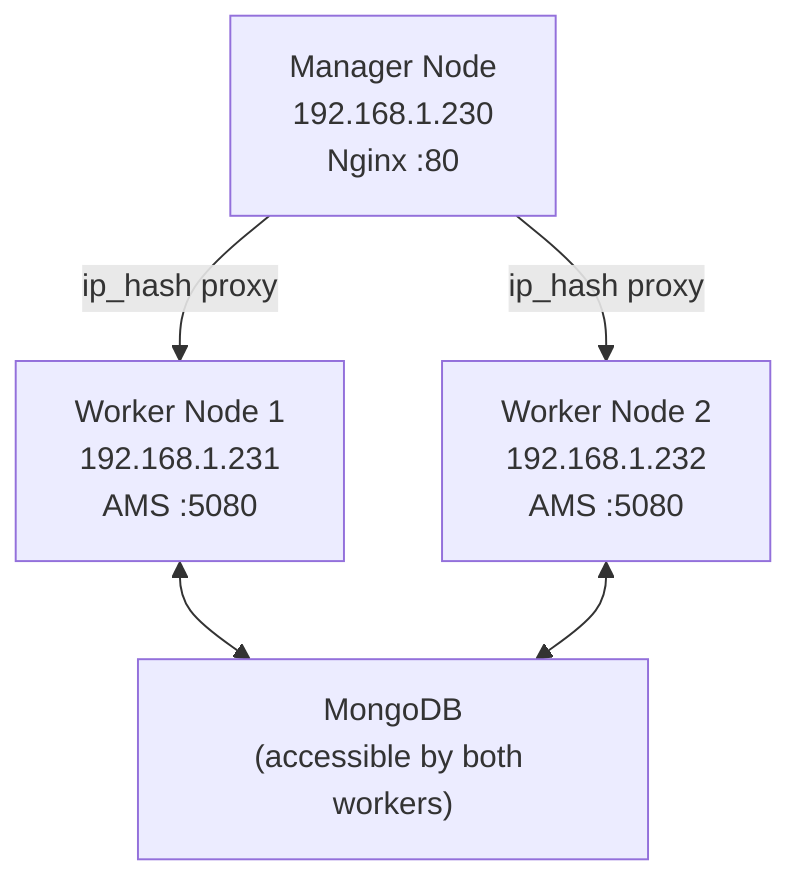

# Deploy AMS with Docker Swarm

Docker Swarm is a container orchestration tool that manages and scales services across a cluster of nodes. This guide deploys Ant Media Server across a 3-node Docker Swarm cluster.



## Test Environment

| Role | IP |
|---|---|
| Manager | 192.168.1.230 |
| Worker Node 1 | 192.168.1.231 |
| Worker Node 2 | 192.168.1.232 |

## Step 1: Install Docker CE on All Nodes

Run the following on **each node** (Manager and both Workers):

```bash
sudo apt install apt-transport-https ca-certificates curl software-properties-common -y
curl -fsSL https://download.docker.com/linux/ubuntu/gpg | sudo apt-key add -
sudo add-apt-repository "deb [arch=amd64] https://download.docker.com/linux/ubuntu focal stable"
sudo apt update && sudo apt install docker-ce -y
sudo systemctl enable docker
```

## Step 2: Initialize Docker Swarm

On the **Manager node**:

```bash
sudo docker swarm init --advertise-addr 192.168.1.230
```

The command outputs a `docker swarm join` token. Run that token command on **Node1 and Node2**:

```bash
sudo docker swarm join --token SWMTKN-1-xxxxx... 192.168.1.230:2377
```

Verify all nodes are visible:

```bash
docker node ls
```

## Step 3: Install Nginx Load Balancer

Create `/opt/nginx/` on all nodes:

```bash
mkdir /opt/nginx
```

Create `/opt/nginx/default.conf` on all nodes:

```nginx
server {
    listen 80;
    location / {
        proxy_pass http://backend;
    }
}
upstream backend {
    ip_hash;
    server 192.168.1.231:5080;
    server 192.168.1.232:5080;
}
```

Deploy the Nginx service from the Manager:

```bash
docker service create \
  --name nginx \
  --mount type=bind,source=/opt/nginx/,target=/etc/nginx/conf.d \
  --constraint node.hostname==master \
  --publish 80:80 \
  nginx
```

## Step 4: Deploy Ant Media Server

On the Manager node, create `stack.yml`. Replace `your_image_url` with your AMS Docker image and `your_mongo_db_address` with your MongoDB address:

```yaml
version: "3.9"
services:
  antmedia:
    image: your_image_url
    entrypoint: /usr/local/antmedia/start.sh -r true -m cluster -h your_mongo_db_address
    deploy:
      mode: global
      resources:
        limits:
          cpus: "0.5"
          memory: 1G
      restart_policy:
        condition: on-failure
    networks:
      - host

networks:
  host:
    name: host
    external: true
```

Deploy the stack:

```bash
docker stack deploy -c stack.yml ant-media-server
```

## Verify

Monitor running services:

```bash
docker service ls
docker ps
```

Access the cluster dashboard at:

```
http://192.168.1.230/
```

The Nginx load balancer distributes requests to the AMS nodes using IP hash for session affinity.
