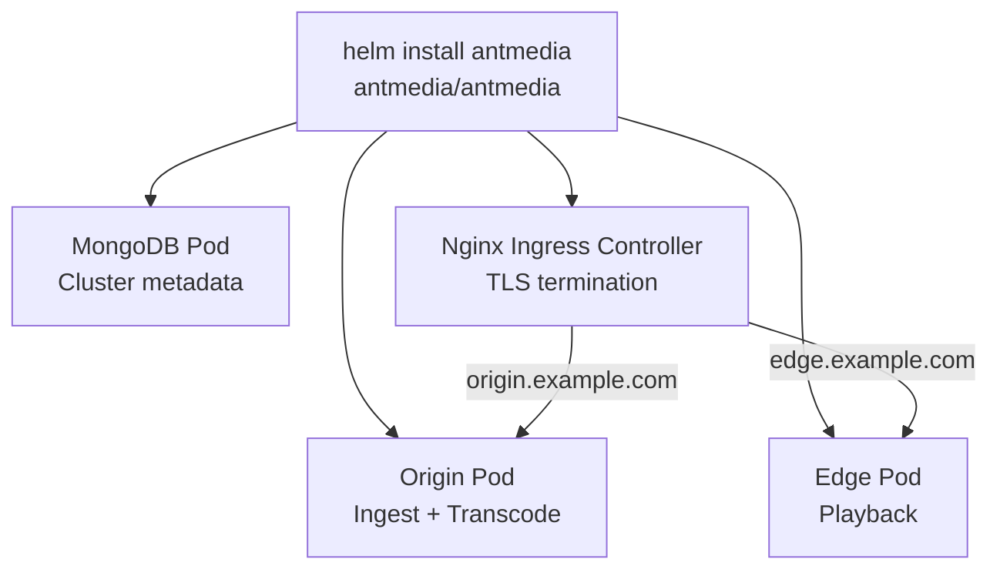

# Deploy AMS with Helm Charts

Helm allows you to deploy, upgrade, and manage Ant Media Server on Kubernetes with a single command.



## Prerequisites

- Kubernetes >= 1.23 (cluster must be ready and accessible)
- Helm v3
- cert-manager (for Let's Encrypt SSL)

## Install Helm

```bash
curl https://baltocdn.com/helm/signing.asc | gpg --dearmor | sudo tee /usr/share/keyrings/helm.gpg > /dev/null
sudo apt-get install apt-transport-https --yes
echo "deb [arch=$(dpkg --print-architecture) signed-by=/usr/share/keyrings/helm.gpg] https://baltocdn.com/helm/stable/debian/ all main" | sudo tee /etc/apt/sources.list.d/helm-stable-debian.list
sudo apt-get update
sudo apt-get install helm
```

## Install the AMS Helm Chart

```bash
helm repo add antmedia https://ant-media.github.io/helm
helm repo update
helm install antmedia antmedia/antmedia \
  --set origin=origin.example.com \
  --set edge=edge.example.com \
  --namespace antmedia \
  --create-namespace
```

After installation, verify pods are running:

```bash
kubectl get pods -n antmedia
```

Expected output:

```
NAME                                              READY   STATUS    RESTARTS   AGE
ant-media-server-edge-7d8fd58f94-dwqbs            1/1     Running   0          2m15s
ant-media-server-origin-57d974f4f7-655rf          1/1     Running   0          2m15s
antmedia-ingress-nginx-controller-6b49f64bfc-...  1/1     Running   0          2m15s
mongo-69888cbbb9-d2zrc                            1/1     Running   0          2m15s
```

## Get Ingress IP and Update DNS

```bash
kubectl get ingress -n antmedia
```

Create DNS A records pointing `origin.example.com` and `edge.example.com` to the Ingress IP.

Verify DNS propagation:

```bash
dig origin.example.com +noall +answer
dig edge.example.com +noall +answer
```

## Install SSL (Let's Encrypt)

Use the provided script for guided SSL installation:

```bash
wget https://raw.githubusercontent.com/ant-media/helm/add_helm_repo/ams-k8s-ssl.sh
bash ams-k8s-ssl.sh
```

Or create a secret manually with your own certificate:

```bash
kubectl create -n antmedia secret tls my-cert --key my-key.pem --cert my-cert.pem
```

Verify certificates are ready:

```bash
kubectl get -n antmedia certificate
```

Expected output shows `READY: True` for both origin and edge certificates.

## Available Helm Parameters

| Parameter | Description | Default |
|---|---|---|
| `image.repository` | Container image repository | `antmedia/enterprise` |
| `image.tag` | Image tag | `latest` |
| `origin` | Origin server domain | `{}` |
| `edge` | Edge server domain | `{}` |
| `hostNetwork` | Use host network (false requires TURN) | `true` |
| `mongodb` | MongoDB host | `mongo` |
| `licenseKey` | AMS license key | `{}` |
| `autoscalingOrigin.minReplicas` | Min Origin replicas | `1` |
| `autoscalingOrigin.maxReplicas` | Max Origin replicas | `10` |
| `autoscalingOrigin.targetCPUUtilizationPercentage` | Origin HPA CPU target | `60` |
| `autoscalingEdge.minReplicas` | Min Edge replicas | `1` |
| `autoscalingEdge.maxReplicas` | Max Edge replicas | `10` |
| `autoscalingEdge.targetCPUUtilizationPercentage` | Edge HPA CPU target | `60` |
| `MongoDBNodeSelector` | Node affinity for MongoDB | `{}` |
| `OriginNodeSelector` | Node affinity for Origin | `{}` |
| `EdgeNodeSelector` | Node affinity for Edge | `{}` |

## Example with Custom Parameters

```bash
helm install antmedia antmedia/antmedia \
  --set origin=origin.antmedia.io \
  --set edge=edge.antmedia.io \
  --set autoscalingEdge.targetCPUUtilizationPercentage=20 \
  --set autoscalingEdge.minReplicas=2 \
  --namespace antmedia \
  --create-namespace
```
