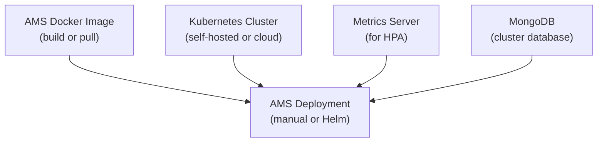

# Prepare Kubernetes Environment for AMS

This guide covers the prerequisites for deploying Ant Media Server on Kubernetes: building a Docker image, setting up a Kubernetes cluster, installing the Metrics Server, and preparing MongoDB.

AMS supports Kubernetes from **version 2.2.0+**.



## Step 1: Get the AMS Docker Image

### Build from Dockerfile

Download the Dockerfile:

```bash
wget https://raw.githubusercontent.com/ant-media/Scripts/master/docker/Dockerfile_Process -O Dockerfile_Process
```

Download the AMS Enterprise Edition ZIP file into the same directory, then build:

```bash
sudo docker build \
  --network=host \
  --file=Dockerfile_Process \
  -t ant-media-server-enterprise-k8s:test \
  --build-arg AntMediaServer=ant-media-server-enterprise-x.x.x.zip .
```

If you are using AWS EKS or a similar cloud service, push the image to [AWS ECR](https://aws.amazon.com/ecr/) or another registry.

### Pull from Docker Hub

```bash
docker pull antmedia/enterprise:latest
```

## Step 2: Set Up a Kubernetes Cluster

### Self-Hosted Cluster

Follow the [official Kubernetes documentation](https://kubernetes.io/docs/home/) to create your own cluster.

### Cloud Managed Services

| Provider | Service |
|---|---|
| AWS | [EKS](./kubernetes-deployment.md) |
| Azure | AKS |
| GCP | GKE |
| DigitalOcean | DOKS |

## Step 3: Install Metrics Server

The Metrics Server is required for Horizontal Pod Autoscaler (HPA). Cloud providers often include it; check first:

```bash
kubectl get pods --all-namespaces | grep -i "metric"
```

Expected output if running:

```
kube-system   metrics-server-5bb577dbd8-7f58c   1/1   Running   7   23h
```

### Manual Installation

```bash
wget https://github.com/kubernetes-sigs/metrics-server/releases/latest/download/components.yaml
```

Edit `components.yaml` and add `--kubelet-insecure-tls` to the Metrics Server container args (line ~132):

```yaml
args:
  - --cert-dir=/tmp
  - --secure-port=443
  - --kubelet-preferred-address-types=InternalIP,ExternalIP,Hostname
  - --kubelet-use-node-status-port
  - --metric-resolution=15s
  - --kubelet-insecure-tls   # add this line
```

Deploy:

```bash
kubectl apply -f components.yaml
kubectl get apiservices | grep "v1beta1.metrics.k8s.io"
```

Expected output:

```
v1beta1.metrics.k8s.io   kube-system/metrics-server   True   21h
```

## Step 4: Prepare MongoDB

MongoDB is required for AMS cluster mode. Choose one of:

- **Direct install** on a server accessible from Kubernetes pods: follow the [cluster installation guide](../cluster-installation.md)
- **MongoDB Atlas**: use the `mongodb+srv://` connection string
- **In-cluster MongoDB**:

```bash
kubectl create -f https://raw.githubusercontent.com/ant-media/Scripts/master/kubernetes/ams-k8s-mongodb.yaml
```

Note the MongoDB IP/hostname, username, and password — you will need them during AMS deployment.

## Step 5: Choose Deployment Type

### With HostNetwork (recommended for WebRTC)

- One AMS pod per node
- Pods get the node's public IP
- WebRTC ICE candidates use node public IPs directly
- No TURN server required

### Without HostNetwork

- Multiple pods per node possible
- WebRTC connectivity requires a TURN server for ICE relay
- Better for environments where TURN is already in place

You are now ready to proceed to the [Kubernetes deployment](./kubernetes-deployment.md) or [Helm deployment](./helm-deployment.md).
