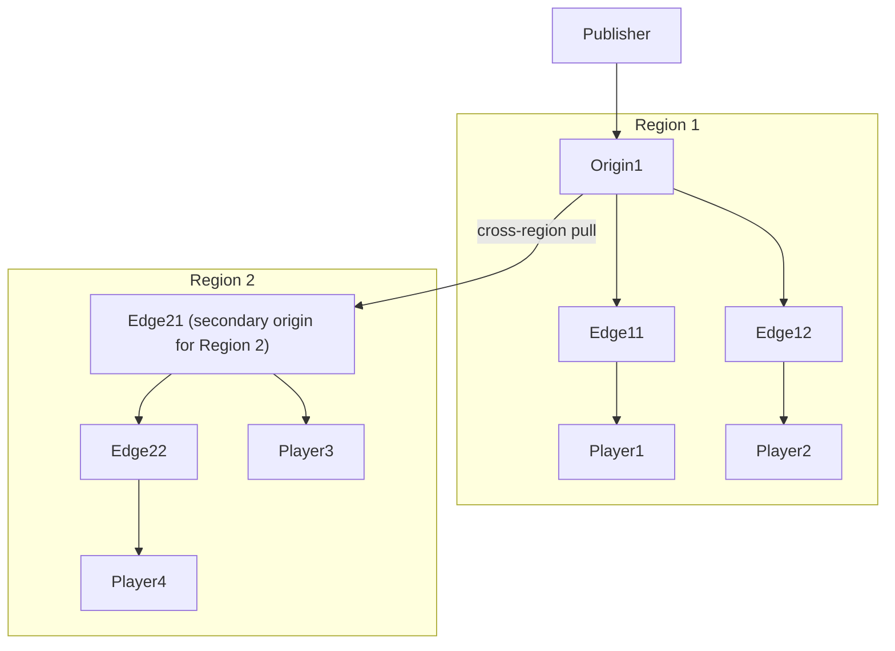

# Multi-Level Cluster

## What is a Multi-Level Cluster?

A cluster that spans different physical regions is called a **Multi-Level Cluster**. Each region has its own origin node for each stream. Ant Media Server can be scaled across different physical locations by setting the `nodeGroup` parameter on each server.

Separating nodes into regions based on physical location provides performance and data-transfer benefits: each region will have its own origin node for a stream, and edges within that region will pull the stream from the regional origin — not from a distant server.

## How It Works



### Scenario 1: Publisher and Players in the Same Region

1. Publisher starts a stream → assigned to `Origin1` in `Region1`.
2. `Player1` (close to `Region1`) requests playback → assigned to `Edge11` in `Region1`.
3. `Edge11` pulls the stream from `Origin1` and delivers to `Player1`.

### Scenario 2: Publisher and Players in Different Regions

1. `Player2` (close to `Region2`) requests playback → assigned to `Edge21` in `Region2`.
2. `Edge21` checks the origin of the stream — no origin exists in `Region2`.
3. `Edge21` assigns itself as the **secondary origin** for this stream in `Region2`.
4. `Edge21` pulls the stream from `Origin1` in `Region1`.
5. `Edge21` delivers to `Player2`.
6. `Player3` in `Region2` requests the same stream → assigned to `Edge22`.
7. `Edge22` sees that `Edge21` is the secondary origin for the stream in `Region2` → pulls from `Edge21` (not from `Origin1` directly).

In short: each stream is served via a **single origin node per region**, even across geolocations.

## How to Configure Multi-Level Cluster

Set the node group (region) of a server by adding the following to `conf/red5.properties`:

```properties
nodeGroup=GROUP_NAME
```

All instances running in the same region must have the **same `nodeGroup` value**.

:::tip
Configure your load balancer to forward publish and play requests to the best region. For a global cluster across geolocations, use a global load balancer such as AWS Route53 or Cloudflare.
:::
