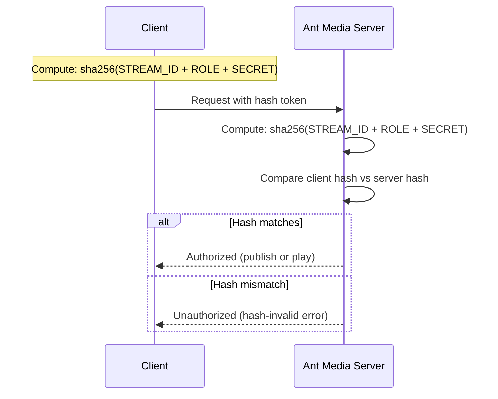

# Hash-Based Token

You can enable Hash-based token for publishing and playing from the application's Advanced settings via the AMS web panel. You have the option to use both the publish and playback tokens simultaneously or just one at a time.

## Configuration

In the application Advanced settings:

```json
"tokenHashSecret": "",
"hashControlPublishEnabled": false,
"hashControlPlayEnabled": false
```

By default, it is disabled. Set to `true` to enable.

:::warning
Do not forget to define a secret key for generating a hash value in `tokenHashSecret`.
:::

## How Hash Evaluation Works



If the related settings are enabled, Ant Media Server generates hash values based on the formula `sha256(STREAM_ID + ROLE + SECRET)` using `streamId`, `role` parameters, and the secret string defined in the settings. It then compares this generated hash value with the client's hash value during authentication.

Once the hash is successfully validated, the client is granted either to publish or play. If the hash is not valid, the error shown below will be generated:


## Generate Hash-Based Token

To generate the Hash token, go to [JavaScript SHA-256](https://geraintluff.github.io/sha256/).

You need to generate a hash value using the formula `sha256(STREAM_ID+ROLE+SECRET)` for your application.

The values used for hash generation:
- `STREAM_ID`: The streamId of the stream, generated in Ant Media Server.
- `ROLE`: Either `"play"` or `"publish"`
- `SECRET`: This is `tokenHashSecret` (defined in the application settings)

**Publish example:**
- STREAM_ID: `stream1`, ROLE: `publish`, SECRET: `testtest`
- Hash = `sha256(stream1publishtesttest)`


**Play example:**
- STREAM_ID: `stream1`, ROLE: `play`, SECRET: `testtest`
- Hash = `sha256(stream1playtesttest)`


## Hash Token Usage by Protocol

### Publish URLs

| Protocol | URL Format |
|----------|-----------|
| RTMP | `rtmp://IP-address-or-domain/live/StreamId?token=tokenId` |
| SRT | `srt://IP-address-or-domain:4200?streamid=live/your-streamId,token=tokenId` |
| WebRTC | `https://domain:5443/live?id=streamId&token=tokenId` |

WebSocket WebRTC publish:
```json
{
  "command": "publish",
  "streamId": "stream1",
  "token": "token"
}
```

### Playback URLs

**VOD:**
```
https://IP-address-or-domain:5443/Application_Name/streams/stream_id.mp4?token=tokenId
```

**HLS:**
```
https://IP-address-or-domain:5443/Application_Name/streams/stream_id.m3u8?token=tokenId
```

**CMAF (DASH):**
```
https://IP-address-or-domain:5443/Application_Name/streams/streamId/streamId.mpd?token=tokenId
```

**WebRTC:**
```
https://domain:5443/live/play.html?id=streamId&token=tokenId
```

WebSocket WebRTC play:
```json
{
  "command": "play",
  "streamId": "stream1",
  "token": "token"
}
```
