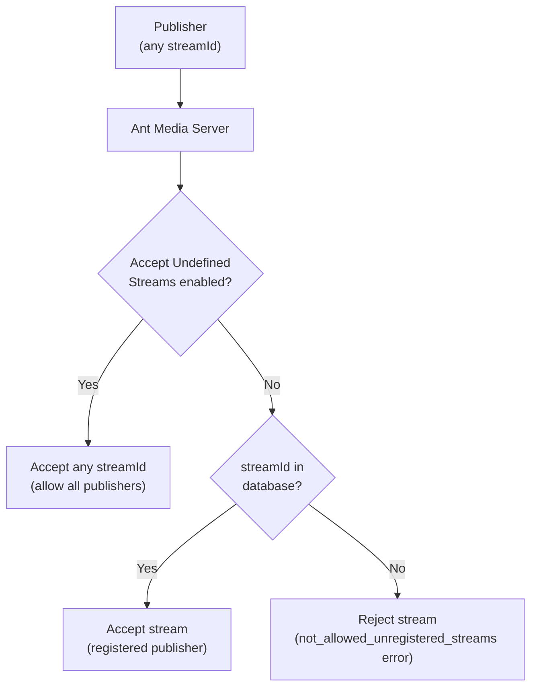

# Accept Undefined Streams

This application setting controls whether the live stream is registered on Ant Media Server before it is allowed to publish.

## Configure Undefined Stream Acceptance

- If Ant Media Server **accepts undefined streams**, it will accept any incoming streams regardless of whether they are registered.
- If the `Accept Undefined Streams` option is **disabled** in application settings, then only streams with their streamId in the database are being accepted by Ant Media Server.

You can find more details about AMS application properties [here](https://antmedia.io/docs/guides/configuration-and-testing/ams-application-configuration/).

## Register a Stream

If this setting is disabled, first register the stream on the server by creating a live stream in the application with stream ID and stream name.

Now only the live stream with the created streamId will be published on the server and all other unregistered streams will be rejected.
