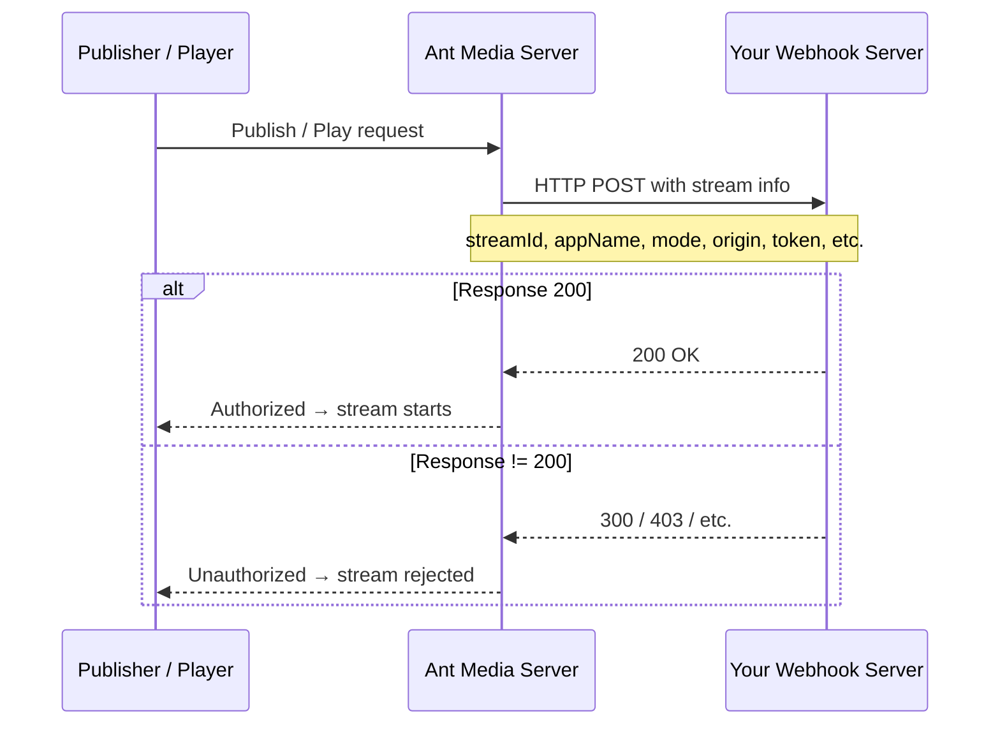

# Webhook Stream Authorization

If the built-in [Security options for Publishing and Playing Streams](https://antmedia.io/docs/category/stream-security/) available in Ant Media Server don't meet your needs and you want full control, you can use webhooks to authorize publishing or playback.

## How Webhook Authorization Works



## Webhook Publish Authorization

Whenever a client attempts to publish a stream, the server sends an HTTP request to your configured webhook address with information regarding the stream (stream name, app name, streamId, etc.).

If your webhook responds with **200**, the server authorizes the stream. Any other response code rejects the stream.

### Enable Publish Webhook Authorization

Go to the Web Panel → Application Settings → Advanced Settings, and set:

```json
"webhookAuthenticateURL": "https://your-webhook-url/endpoint"
```

**Test with webhook.site:**

```json
"webhookAuthenticateURL": "https://webhook.site/e8c87b00-30aa-4a98-b4f0-6ff1eeddb6e5"
```

When a stream starts publishing, the webhook URL receives a request:


**If response is 200 (authorized):**
```
INFO  i.a.s.AcceptOnlyStreamsWithWebhook - Response from webhook is: 200 for stream:stream1
INFO  i.a.e.w.WebSocketEnterpriseHandler - Is publishing allowed through Webhook Authentication: true
```

**If response is non-200 (rejected):**
```
INFO  i.a.s.AcceptOnlyStreamsWithWebhook - Response from webhook is: 300 for stream:stream1
WARN  i.a.s.AcceptOnlyStreamsWithWebhook - The connection object is null for stream1
INFO  i.a.e.w.WebSocketEnterpriseHandler - Is publishing allowed through Webhook Authentication: false
```

Webhook publish authentication works with all publish types: **SRT, RTMP, and WebRTC**.

## Webhook Play Authorization

Starting with Ant Media Server version 2.9.1, you can enable webhook play authorization for **WebRTC play** requests.

When a client attempts to play a stream using WebRTC, Ant Media Server sends a POST request to your specified webhook endpoint. If your application server responds with **200**, the viewer is authorized. Any other response code prevents playback.

### Enable Play Webhook Authorization

Go to Advanced Settings and set:

```json
"webhookPlayAuthUrl": "https://your-webhook-url/play-endpoint"
```

### POST Request Payload

When `webhookPlayAuthUrl` is set, the POST request sent by Ant Media Server will contain:

```json
{
  "streamId": "teststream",
  "mode": "play",
  "appName": "live",
  "origin": "[domain_of_request_origin]",
  "token": "token_if_passed",
  "subscriberCode": "subscriber_code_if_passed",
  "subscriberId": "subscriberId_if_passed",
  "metaData": {"key": "value"}
}
```

The `origin` field is particularly useful — you can check if the request is coming from your website, and if not, reject it by returning a non-200 response code.

### Include Client IP Address in Payload

To add the client's IP address to the POST request payload, add a JVM argument to Ant Media Server service:

1. Open the Ant Media Server service file:
   ```bash
   sudo vim /etc/systemd/system/antmedia.service
   ```

2. Add the below line to `ExecStart`:
   ```
   --add-opens java.base/sun.nio.ch=ALL-UNNAMED
   ```

3. Reload and restart:
   ```bash
   sudo systemctl daemon-reload
   sudo systemctl restart antmedia
   ```

With this flag, the webhook play auth payload will also include:

```json
{
  ...
  "ipAddress": "127.0.0.1"
}
```

If running with `./start.sh`, add to `TOMCAT_OPTS`:
```bash
TOMCAT_OPTS="-Dcatalina.home=$RED5_HOME -Dcatalina.useNaming=true -Djava.net.preferIPv4Stack=true --add-opens java.base/sun.nio.ch=ALL-UNNAMED"
```
