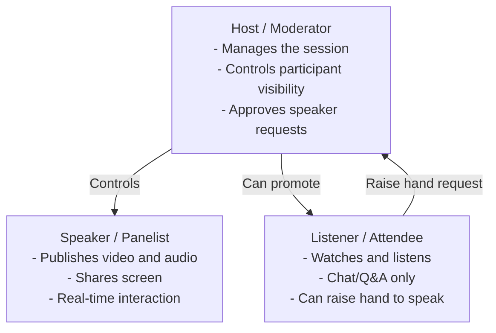

# Webinar in Action

## Webinar Roles

A Circle Webinar session involves three main roles:



### 1. Host (Moderator)

- Responsible for managing the webinar session.
- Makes participants visible to listeners.
- Controls muting/unmuting participants and turning off cameras.
- Can accept listeners' requests to become a publisher (temporary speaker).
- Can revert a temporary speaker back to listener status.

### 2. Speaker (Panelist / Presenter)

- Delivers the main content of the webinar (video, audio, or shared screen).
- Can present slides, share the screen, and interact with the host and attendees in real time.
- Typically limited to a few selected participants chosen by the host.

### 3. Listener (Attendee / Participant)

- Joins the webinar mainly to watch and listen.
- Usually receives the stream with **WebRTC** (for interactivity) or **HLS/DASH** (for scalability).
- Can interact through chat, Q&A, and other audience engagement tools based on permissions.
- Cannot directly broadcast audio/video unless promoted by the host.

## Joining a Webinar Room

### Join as Host

```
https://domain:5443/webinar/room1?role=host&streamName=host&skipSpeedTest=true
```

The host can see every speaker in the room.

### Join as Speaker

```
https://domain:5443/webinar/room1?role=speaker&streamName=speaker&skipSpeedTest=true
```

The speaker can also see the host by default (configurable via `participantVisibilityMatrix`).

### Join as Listener

```
https://domain:5443/webinar/room1?role=listener&streamName=listener&skipSpeedTest=true&playOnly=true
```

In `playOnly` mode, the listener cannot see anyone when joining by default, but can still interact via the chat box.

## Host Controls

### Allow a Speaker to Be Visible to Listeners

By default, speakers are not visible to listeners. The host can enable a speaker to be watched by all listeners via the host UI controls. Once activated, the listener can see the speaker in the room.

### Allow a Listener to Become a Speaker

If a listener wants to speak:
1. The listener raises their hand using the request button in the UI.
2. The host receives the request notification.
3. The host can **allow** or **deny** the listener's request.

When approved, the listener becomes a temporary speaker.

## Scope of Roles

The visibility scope for each role can be configured via the application's advanced settings using the `participantVisibilityMatrix` property:

```json
"participantVisibilityMatrix": {
    "host": [
        "host",
        "active_host",
        "speaker",
        "active_speaker",
        "listener",
        "temp_listener",
        "active_temp_listener"
    ],
    "speaker": [
        "host",
        "active_host",
        "speaker",
        "active_speaker",
        "temp_listener",
        "active_temp_listener"
    ],
    "listener": [
        "active_host",
        "active_speaker",
        "active_temp_listener"
    ]
}
```

| Role | Default Visibility |
|---|---|
| `host` | Sees everyone (all role types) |
| `speaker` | Sees host, other speakers, and active temp listeners |
| `listener` | Sees only active hosts, active speakers, active temp listeners |

:::info
The main roles are `host`, `speaker`, `listener`, and `active_speaker` (speaker the host has made visible to listeners).

Other roles (`active_host`, `temp_listener`, `active_temp_listener`) are available for advanced configuration.
:::
