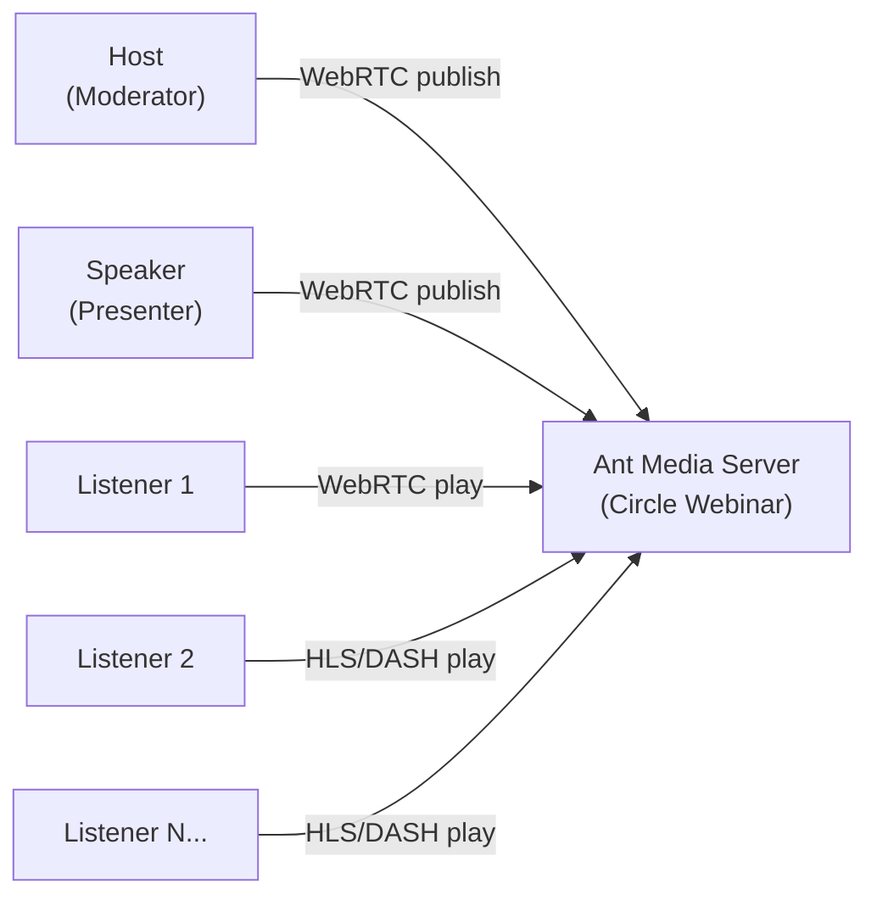

# Circle Webinar Solution

The **Circle Webinar Solution** is built on the same core technology as Ant Media Server's [Circle video conferencing tool](https://antmedia.io/docs/guides/conference/circle-video-conference-solution/), but extended to support large-scale webinar scenarios. While Circle provides interactive video conferencing for small to medium groups, Circle Webinars adds features such as audience scalability, presenter–attendee roles, and seamless integration with ultra-low latency streaming.

This makes it ideal for online events, trainings, and broadcasts where a few presenters interact with a large number of participants.

## What is a Webinar?

A **webinar** (web-based seminar) is an online event that allows one or more presenters to share video, audio, and content with a remote audience in real time.

Webinars are widely used in various industries:

| Industry | Use Cases |
|---|---|
| **Education** | Online classes, virtual classrooms, interactive lectures |
| **Corporate Training** | Employee training, workshops, onboarding sessions |
| **Online Events** | Product launches, conferences, panel discussions, live Q&A |
| **Community & Nonprofit** | Awareness campaigns, public information sessions, knowledge sharing |

Webinars combine the reach of traditional live streaming with the interactivity of real-time communication, enabling direct engagement between presenters and participants.

## Why Ant Media Server for Webinars

Ant Media Server provides a robust and flexible platform for hosting webinars of any size. Unlike traditional streaming solutions that suffer from high latency, Ant Media Server leverages **WebRTC technology** to achieve **ultra-low latency (less than 0.5 seconds)**, ensuring seamless interaction between presenters and attendees.

Key advantages:

- **Scalability**: Support for small meetings to large-scale webinars with thousands of participants.
- **Ultra-Low Latency**: Real-time video and audio delivery for interactive experiences.
- **Interactivity**: Features like screen sharing, multiple presenters, and real-time chat/Q&A.
- **Cross-Platform Support**: Works on browsers, mobile devices, and desktop applications without requiring additional plugins.

## Try the Circle Webinar Solution

Visit [meet.antmedia.io/webinar](https://meet.antmedia.io/webinar/) to test the Circle Webinar Solution.
